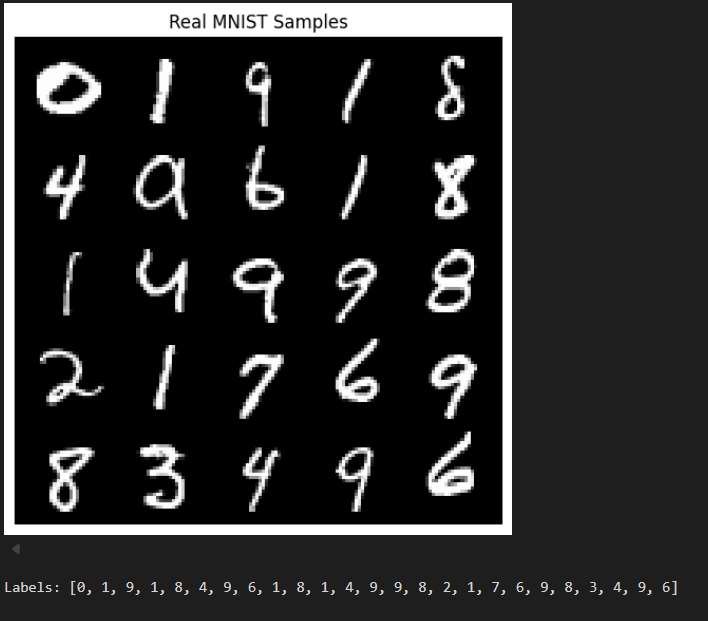
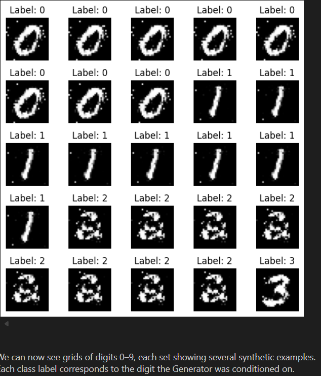
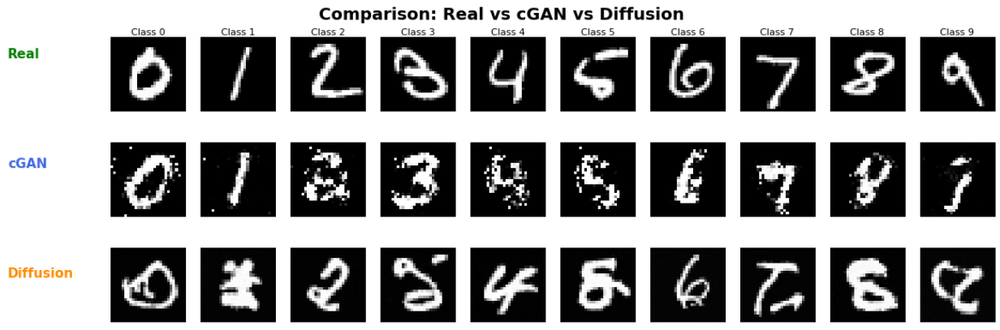

## Synthetic Handwriting Generator for CAPTCHA Systems

## Project Overview

This project implements and evaluates conditional generative models for generating synthetic handwritten digit images for CAPTCHA-style human verification systems.

The goal is to create diverse, human-like handwritten digits that can be used as synthetic training data for a next-generation CAPTCHA classifier. The project compares two generative approaches:

- Conditional Generative Adversarial Network (cGAN)
- Conditional Diffusion Model

Both models are trained on MNIST and evaluated using visual comparison, Frechet Inception Distance (FID), and downstream classifier accuracy.

---

## Business Context

SuperCognition Labs is a cybersecurity company focused on advanced bot detection and human verification systems.

Traditional CAPTCHA systems based on simple geometric fonts can be vulnerable to automated bots. Synthetic handwritten digits provide a more diverse and human-like dataset that is harder for simple rule-based bots to replicate.

This project demonstrates how generative AI can support scalable synthetic handwriting generation for robust CAPTCHA systems.

---

## Project Structure

```text
Synthetic Handwriting Generator for CAPTCHA Systems/
├── data_utils/
│   └── dataloader.py
├── model/
│   ├── __init__.py
│   ├── cgan.py
│   └── diffusion.py
├── training/
│   ├── train_cgan.py
│   └── train_diffusion.py
├── utils/
│   ├── __init__.py
│   ├── checkpoint.py
│   └── visualize.py
├── 00_data_preparation.ipynb
├── 01_cGAN_training.ipynb
├── 02_diffusion_training.ipynb
├── 03_evaluation.ipynb
├── README.md
├── screeshots/
│   ├── Comparison_Real_vs_cGAN_vs_Diffusion.png
│   ├── Generate_and_Visualize_samples.png
│   └── Visualize_real_MNIST_images.png
└── .gitignore

```

---

## Results Screenshots

The following screenshots provide visual evidence of the completed generative modeling workflow, including real MNIST samples, generated synthetic samples, and the final comparison between real, cGAN-generated, and diffusion-generated digits.

### Real MNIST Samples

This figure shows examples of real MNIST handwritten digits used as the reference dataset for training and evaluation.



---

### Generated Synthetic Samples

This figure shows generated digit samples produced by the trained generative models. The samples are conditioned on class labels and demonstrate the models' ability to generate digit-like handwritten images.



---

### Real vs cGAN vs Diffusion Comparison

This figure compares real MNIST samples against outputs generated by the Conditional GAN and the Conditional Diffusion Model. It provides a qualitative view of output realism, class-conditioning quality, and visual diversity.


#### Data / 

+ `dataloader.py` 
   + Loads the MNIST Dataset
   + Applies standard transform
   + Helper functions to load data in notebooks 

#### Model / 
+ `cgan.py`
   **Defines**: 
   + **Generator(G)** - takes noise + class label and outputs a 28 x 28 image. 
   + **Discriminator(D)** - takes image + class label and outputs real/fake probability 


   - **Student ToDos**:
        + Implement the label - conditioning logic in the G and D forward passes.
        + Make sure image tensors are reshaped correctly on output/input

+ `diffusion.py`
   **Defines**:
   + `timestep_embedding` - converts diffusion step t into an embedding vector 
   + `ResidualBlock` - convolutional block with time + label conditioning and residual connection
   + `ConditionalUNet` - encoder-decoder UNet that predicts noise for a given noisy image, timestep, and label 

   - **Student ToDos**:
        + Implement the UNet forward pass:
            time embedding -> down path -> bottleneck -> up path -> output noise prediction

#### Training /
+ `train_cgan.py`
   Implements the adversarial training loop for the cGAN


   - **Student ToDos**:
        + Complete the Generator update step (Sample noise/labels, generate images, compute generator loss, update weights)
        + Complete the Discriminator update step (compute real vs fake loss, average, backprop)
        + Add Checkpoint saving

+ `train_diffusion.py`
   **Defines**:
   + `linear_beta_schedule` - builds a simple noise schedule 
   + `sample_images` - runs the reverse diffusion process to sample from noise
   + `train_diffusion` - trains the diffusion model via noise prediction

   - **Student ToDos**:
       + In `train_diffusion`: Implement forward diffusion (add noise) and the MSE noise-prediction training step 
       + In `sample_images`: Implement the reverse diffusion update loop to gradually denoise images


#### Utils / 
`checkpoint.py`: Helper functions to save and load model + optimizer states
`metrics.py`:  Helper functions to calculate evaluation metrics
`visualize.py`: Helper functions for plotting batches of Images and comparison grids
   

### Notebooks Overview 
The noteboks are the main entry point for running the project. They use the modules above and contain additional **notebook-level ToDos** to wire piece together and interpret the results 

+ `00_data_preparation.ipynb` - Downloads and loads MNIST data, visualizes sample digits 
+ `01_cGAN_training.ipynb` - Imports `Generator`, `Discriminator` and ``train_cGAN``, sets up models, training loops for specified epocs and visualizes generated digits per class
+ `02_diffusion_training.ipynb` - Imports `ConditionalUNet`, `train_diffusion`, and ``sample_images``, trains the difusion model and samples class-conditioned digits 
+ `03_evaluation.ipynb` - Loads Real MNIST test set, synthetic samples from cGAN and Diffision, runs visual comparison (real vs cGAN vs Diffusion per class), FID computation between real vs synthetic, a simple CNN classifier trained on synthetic data and evaluated on real data 


## How to Work with the Starter Code 

+ Read the docstrings and comments first. 
Each module explains its purpose and the role of the ToDos

+ Complete the module-level ToDOs before training. 
In order: 

+ `model/cgan.py`
+ `model/diffusion.py`
+ `training/train_cgan.py`
+ `training/train_diffusion.py`

+ Then use the notebooks to run experiments and visualize results 


## What You Should Aim to Understand 
By the end of this project, you should be comfortable with 
+ How **conditional GANS** and **conditional Diffusion** models generate images from noise + labels 
+ How to implement basic training loops  for both models in PyTorch 
+ How to:
    - Visually inspect generative outputs
    - Use **FID** as a realism/diversity metric

Before coding, make sure all libraries are imported correctly, read through the objectives and ToDos, and keep brief notes on what you observe as you train and evaluate both models
